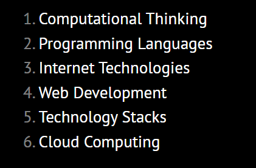

CS50-s-Computer-Science-for-Business-Professionals 😎
=====================

-   [Course Link](https://cs50.harvard.edu/python/2022/)
-   [My Certificate](https://certificates.cs50.io/b1b40aca-5873-48f4-b612-21cd620c7ef1.pdf?size=letter)
-   [Final Project](https://github.com/Elmoumen202a/Harvard-CS50-Python/tree/main/Final%20Project)
## What is it?

An introduction to programming using a language called Python. Learn how to read and write code as well as how to test and “debug” it. Designed for students with or without prior programming experience who’d like to learn Python specifically.

-   ✅ Videos
-   ✅ assignments & Final Project
-   ✅ Slides & Notes
-   ✅ grading in this course is not done automatically, and there are human reviewers for each assignment.

>This course is graded by human graders, and has a ZERO TOLERANCE plagiarism and collaboration policy.

## Table of Contents

  * [Computational Thinking](https://cs50.harvard.edu/business/2017/weeks/1/)
  * [Programming Languages](https://cs50.harvard.edu/business/2017/weeks/2/)
  * [Internet Technologies](https://cs50.harvard.edu/business/2017/weeks/3/)
  * [Web Development](https://cs50.harvard.edu/business/2017/weeks/4/)
  * [Technology Stacks](https://cs50.harvard.edu/business/2017/weeks/5/)
  * [Cloud Computing](https://cs50.harvard.edu/business/2017/weeks/6/)

I finished this course on January 17, 2023.
The picture below shows my certificate after completing all the assignments:

