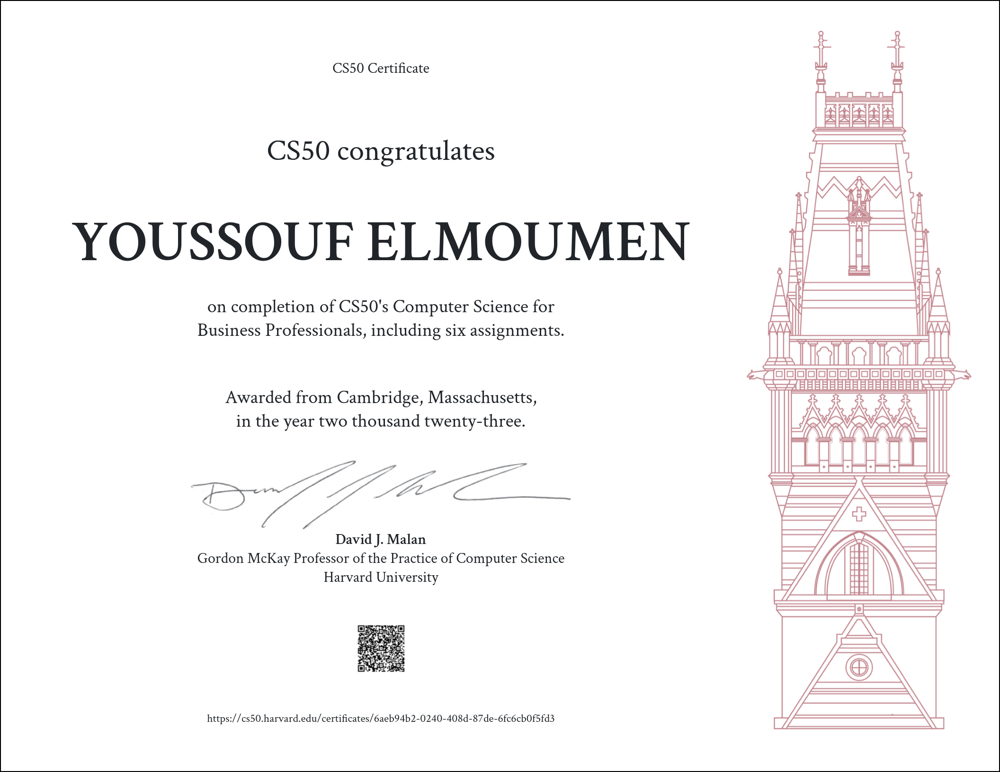

CS50-s-Computer-Science-for-Business-Professionals 😎
=====================

-   [Course Link](https://cs50.harvard.edu/python/2022/)
-   [My Certificate](https://certificates.cs50.io/b1b40aca-5873-48f4-b612-21cd620c7ef1.pdf?size=letter)
## What is it?

This course is  for business professionals. This course takes a top-down approach, emphasizing mastery of high-level concepts and design decisions related thereto. Ultimately this course empowers students to make technological decisions even if not technologists themselves. Topics include cloud computing, networking, privacy, scalability, security, and more, with an emphasis on web and mobile technologies. Students emerge from this course with first-hand appreciation of how it all works and all the more confident in the factors that should guide their decision-making. This course is designed for managers, product managers, founders, and decision-makers more generally.

-   ✅ Videos
-   ✅ assignments & Final Project
-   ✅ Slides & Notes
-   ✅ grading in this course is not done automatically, and there are human reviewers for each assignment.

>This course is graded by human graders, and has a ZERO TOLERANCE plagiarism and collaboration policy.

## Table of Contents

  * [Computational Thinking](https://cs50.harvard.edu/business/2017/weeks/1/)
  * [Programming Languages](https://cs50.harvard.edu/business/2017/weeks/2/)
  * [Internet Technologies](https://cs50.harvard.edu/business/2017/weeks/3/)
  * [Web Development](https://cs50.harvard.edu/business/2017/weeks/4/)
  * [Technology Stacks](https://cs50.harvard.edu/business/2017/weeks/5/)
  * [Cloud Computing](https://cs50.harvard.edu/business/2017/weeks/6/)

I finished this course on January 17, 2023.
The picture below shows my certificate after completing all the assignments:

